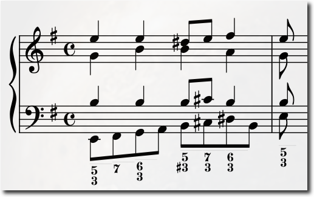

# Continui

An automatic continuo realization tool.

### Basso Continuo
The rules of playing continuo are many but mostly straightforward; one can produce a passable result by blindly following a few important rules. Continui considers these rules and assigns a quantity called "badness" associated to breaking such rules. A search is then conducted over all reasonable realizations (up to a certain point in the future) to minimize badness. These realizations are then stitched together.

As an example, the opening to BWV 1034 can be given as input like so:

```
meter: 4x1/4
voices: 3
bassline:

e: E2:1/8;<5 3> F#2:1/8 G2:1/8;<6 3> A2:1/8 B2:1/8;<5 3#> C#3:1/8;<7 3> D#3:1/8;<6 5 3> B2:1/8 E3:1/8;<5 3> ||
```

This produces the following realization:



Note the parallel octaves between the bass and tenor; this is due to the fact that contrapuntal errors have not been yet(but will soon be!) added to the penalty/badness calculation.

**TODO**

- Refine penalty calculations
- Develop better method for user input
- Use SDL and/or fluidsynth to render and playback visualization
